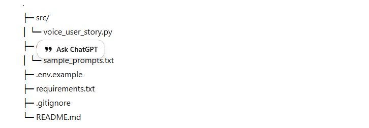

# 🎙️ Voice → Agile User Story (LangChain Structured Output)

Speak your requirement; get a **clean, structured Agile user story** as JSON:
- `title`
- `description`
- `acceptance_criteria` *(comma-separated Python list)*
- `severity` *(Low / Medium / High / Critical)*
- `type` *(feature / bug fix / improvement / technical task)*

Powered by:
- **SpeechRecognition** + **PyAudio** (mic capture & Google Speech API transcription)
- **LangChain** `StructuredOutputParser` + **OpenAI** GPT-4o-mini (schema-aligned JSON)

---

## ✨ What it does

1. Listens to your voice (up to ~15s).
2. Transcribes to text using Google’s free recognizer.
3. Prompts the LLM with a **response schema** so output is strict JSON.
4. Prints the parsed Python `dict`.

## 🧱 Project layout



---

## 🔐 Setup


git clone https://github.com/<your-username>/voice-to-agile-user-story.git

cd voice-to-agile-user-story

python -m venv .venv

*# macOS/Linux:
source .venv/bin/activate

*# Windows:
.venv\Scripts\activate

pip install -r requirements.txt


Microphone deps

* Windows

pip install pipwin
pipwin install pyaudio


* macOS

brew install portaudio
pip install pyaudio


* Linux (Debian/Ubuntu)

sudo apt-get update
sudo apt-get install -y portaudio19-dev
pip install pyaudio

Create .env from the template and add your key:

cp .env.example .env

// edit .env and set OPENAI_API_KEY


---

▶️ Run
python src/voice_user_story.py


You’ll see:

Start Speaking...
You said: <transcribed text>


Then a JSON like:

{
  "title": "Stay Logged In option",
  "description": "As a user, I want a 'Stay logged in' option so I don't re-enter credentials each time.",
  "acceptance_criteria": [
    "Session persists across browser restarts when 'Stay logged in' is selected",
    "Idle timeout policies still apply per security requirements",
    "Manual sign-out clears session and requires re-authentication"
  ],
  "severity": "Medium",
  "type": "feature"
}

The script prints a Python dict parsed by StructuredOutputParser.

---

🧠 How it works (high level)

Transcribe voice: SpeechRecognition + sr.Microphone → recognize_google(audio)

Schema: ResponseSchema fields for title, description, acceptance_criteria, severity, type

Prompt: ChatPromptTemplate instructs the model to output JSON with those keys

Parse: StructuredOutputParser.from_response_schemas(...) → parse(response.content)

---

🎯 Tips

If JSON varies, lower temperature (e.g., 0.2) for more consistent outputs.

For multi-item acceptance criteria, the prompt asks for a comma-separated Python list which the parser then parses.

Want bullet ACs instead? Change schema to an array and adjust the prompt accordingly.

🔧 Troubleshooting

Mic not found / Permission denied: Allow microphone access in OS settings.

pyaudio install errors: Install PortAudio (see Setup) before pip install pyaudio.

RequestError from Google recognizer: Check internet; the free recognizer is rate-limited and not private.

Privacy: Google’s recognizer sends audio to Google; for local STT, try vosk.

---

🔮 Roadmap

Switch to local STT (Vosk/Whisper.cpp) for privacy.

Add CLI arg to pass an audio file instead of mic input.

Export to Jira/Azure Boards with a single command.

---

📄 License

MIT


---

## 🧽 (Optional) tiny code tidy-ups

- You import `ChatOpenAI` twice (from `langchain.chat_models` and `langchain_openai`). Keep the **`langchain_openai`** import and remove the deprecated one:
  ```python
  # from langchain.chat_models import ChatOpenAI  # remove
  from langchain_openai import ChatOpenAI        # keep


Consider making acceptance_criteria an array in the schema instead of a string list; then you won’t need to split later.